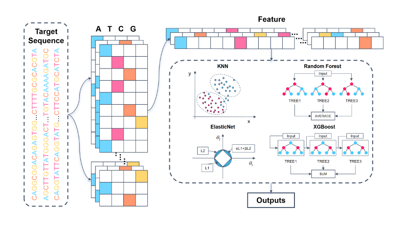

# CERP-ML

## Model architecture

CERP-ML (CRISPR/Cas9 Editing Result Predictor Based on Machine Learning Models) is a machine learning model designed to predict the editing outcomes of a given DNA sequence. The input to the model is a 60bp DNA sequence, and the output is the frequency of 557 possible editing results. Upon receiving the DNA sequence, the model first performs one-hot encoding, converting the sequence into a feature vector of 240 dimensions. This vector serves as the input feature for the machine learning model. The output is a 557-dimensional vector representing the probabilities of 557 editing outcomes.



## Requirements:
- joblib==1.4.2
- matplotlib==3.9.2
- numpy==2.1.1
- pandas==2.2.3
- RNA==0.13.2
- scikit_learn==1.5.2
- scipy==1.14.1
- seaborn==0.13.2
- ViennaRNA==2.6.4
- xgboost==2.1.1

```py
pip install -r requriements.txt
```

## Usage
The model parameters for the 557 edit result prediction tasks, the 1bp insertion prediction task and the 1bp deletion prediction task are all under the path 'machine_learning/model_param', take the 557 edit result prediction tasks as an example, if you want to use the model to make a prediction, you can do so in the python run the following code:
```py
import joblib
from utils import dna_to_onehot

test_seqs = ['GGTCGGGATGAAGCTGCAGGGCTAGTTTCCTATAGGCCTTTTTAATATCCTTTATAGAGG',
            'CAATTGTCGGCAAGAGATGCGGACCACCCAGCTGGGCCCTGGGCGCTTCCAAATGACCCA']
inputs = dna_to_onehot(test_seqs)

model_save_path = '/machine_learning/model_param/bset_reg.pkl'
regressor = joblib.load(model_save_path)
outputs = regressor.predict(inputs) # outputs.shape = (2, 557)
```